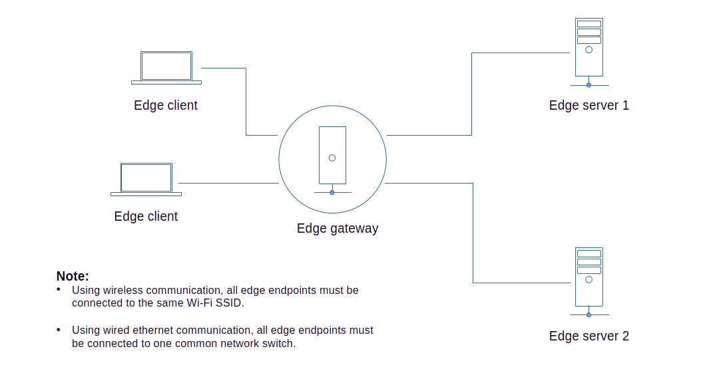

## Edge Gateway



Instead of the edge clients accessing directly the edge servers, we will create an edge gateway that will act as a broker between the edge clients and edge servers.  

<br>

### Edge Server 1 Setup

#### 1. Save the code below as *server.js* in your server 1 project directory.

```js
const m2m = require('m2m')

let edge = new m2m.Edge()

// simulated voltage data source
function dataSource(){
  return 20 + Math.floor(Math.random() * 10)
}

m2m.connect(() => {

  /******************
    
     edge server 1
    
   ******************/

  let port = 8134 // server1 port using localhost ip

  edge.createServer(port, (server) => {

    server.on('error', (error) => { 
      console.log('error:', error)
    })

    server.dataSource('voltage-source', (tcp) => {
      tcp.send(dataSource())         
    })
  })
})
```
#### 2. Start your application.

```js
$ node server.js
```

### Edge Server 2 Setup

#### 1. Save the code below as *server.js* in your server 2 project directory.

```js
const m2m = require('m2m')

let edge = new m2m.Edge()

// simulated temperature data source
function dataSource(){
  return 50 + Math.floor(Math.random() * 10)
}

m2m.connect(() => {

  /******************
    
     edge server 2
    
   ******************/

  let port = 8135 // server2 port using localhost ip

  edge.createServer(port, (server) => {

    server.on('error', (error) => { 
      console.log('error:', error)
    })

    server.dataSource('temp-source', (tcp) => {
      tcp.send(dataSource())         
    })
  })
})
```
#### 2. Start your application.

```js
$ node server.js
```

### Edge Gateway Setup

#### 1. Save the code below as *gateway.js* in your gateway project directory.

```js
const m2m = require('m2m')

let edge = new m2m.Edge()

m2m.connect(() => {

  /***********************
    
     edge gateway server
    
   ***********************/

  let ec1 = new edge.client(8134) // access server1
  let ec2 = new edge.client(8135) // access server2

  let port = 8129 // gateway server port using localhost ip

  edge.createServer(port, (server) => {

    server.on('error', (error) => { 
      console.log('error:', error)
    })

    // monitor the connected clients 
    server.on('connection', (count) => { 
      console.log('gateway connected client', count)
    })

    server.publish('temperature', async (tcp) => {
      let data = await ec2.read('temp-source')
      tcp.send({type:'temperature', value:data.toString()})   
    })

    server.publish('voltage', async (tcp) => {
      let data = await ec1.read('voltage-source')
      tcp.send({type:'voltage', value:data.toString()})    
    })
  })
})
```
#### 2. Start the application.
```js
$ node gateway.js
```
### Edge Client Setup

#### 1. Save the code below as *client.js* in your client project directory.
```js
const m2m = require('m2m')

let edge = new m2m.Edge()

m2m.connect(() => {

  /****************
    
     edge client
    
   ****************/
 
  let ec = new edge.client(8129) // access the gateway server only

  ec.on('error', (error) => { 
    console.log('error:', error)
  })

  ec.on('ready', (result) => { 
    console.log('ready:', result)
  })

  ec.sub('voltage', (data) => {
    console.log('voltage', data)
  })

  ec.sub('temperature', (data) => {
    console.log('temperature', data)
  })
})
```
#### 2. Start the application.

```js
$ node client.js
```
You should get a similar result as shown below.
```js
ready: true
voltage { type: 'voltage', value: '21' }
temperature { type: 'temperature', value: '56' }
voltage { type: 'voltage', value: '22' }
temperature { type: 'temperature', value: '52' }
voltage { type: 'voltage', value: '23' }
temperature { type: 'temperature', value: '54' }

```


