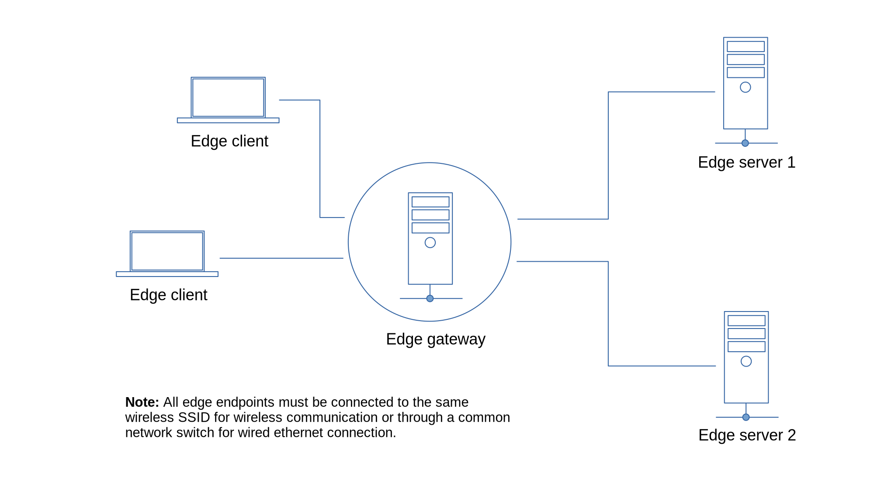

## Edge Gateway



Instead of the edge clients accessing directly the edge servers, we will create an edge gateway that will act as a broker between the edge clients and edge servers.  

<br>

### Edge Server 1
#### 1. Save the code below as *server.js* in your server 1 project directory.

```js
const m2m = require('m2m')

// simulated voltage data source
function dataSource(){
  return 20 + Math.floor(Math.random() * 10)
}

let edge = new m2m.Edge()
let port = 8134

m2m.connect(() => {
  edge.createServer(port, (server) => {

      server.dataSource('voltage-source', (tcp) => {
          tcp.send(dataSource())         
      })

      server.on('error', (err) => { 
          console.log('error:', err.message)
      })
  })
})
```
#### 2. Start your application.

```js
$ node server.js
```

### Edge Server 2
#### 1. Save the code below as *server.js* in your server 2 project directory.

```js
const m2m = require('m2m')

// simulated temperature data source
function dataSource(){
  return 50 + Math.floor(Math.random() * 10)
}

let edge = new m2m.Edge()
let port = 8135 

m2m.connect(() => {
  edge.createServer(port, (server) => {

      server.dataSource('temp-source', (tcp) => {
          tcp.send(dataSource())         
      })

      server.on('error', (err) => { 
          console.log('error:', err.message)
      })
  })
})
```
#### 2. Start your application.

```js
$ node server.js
```

#### 1. Save the code below as *gateway.js* in your gateway project directory.
### Edge Gateway
```js
const m2m = require('m2m')

let edge = new m2m.Edge()
let port = 8129

m2m.connect(app)

function app(){
  let ec1 = new edge.client(8134)
  let ec2 = new edge.client(8135)

  // edge gateway server
  edge.createServer(port, (server) => {

      server.publish('voltage', (tcp) => {
          ec1.read('voltage-source', (data) => {
              tcp.send({type:'voltage', value:data.toString()})    
          })
      })

      server.publish('temperature', (tcp) => {
          ec2.read('temp-source', (data) => {
              tcp.send({type:'temperature', value:data.toString()})   
          })
      })

      // monitor the connected clients ensuring the connections does not continously increase 
      server.on('connection', (count) => { 
          console.log('gateway connected client', count)
      })
  })
}
```
#### 2. Start the application.
```js
$ node gateway.js
```

#### 1. Save the code below as *client.js* in your client project directory.
### Edge Client
```js
const m2m = require('m2m')

let edge = new m2m.Edge()

m2m.connect(app)

function app(){
  // access the gateway server only
  let ec1 = new edge.client(8129)

  ec1.sub('voltage', (data) => {
      console.log('voltage', data)
  })

  ec1.sub('temperature', (data) => {
      console.log('temperature', data)
  })

  ec1.on('error', (err) => { 
      console.log('error:', err.message)
  })
}
```
#### 2. Start the application.

```js
$ node client.js
```
You should get a similar result as shown below.
```js
voltage { type: 'voltage', value: '21' }
temperature { type: 'temperature', value: '56' }
voltage { type: 'voltage', value: '22' }
temperature { type: 'temperature', value: '52' }
voltage { type: 'voltage', value: '23' }
temperature { type: 'temperature', value: '54' }

```


